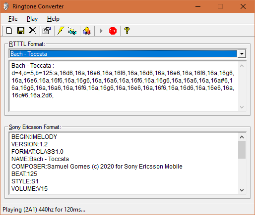

# RingtoneConverter

A standard RTTTL ringtone to Sony Ericsson IMY ringtone converter program that I wrote ages ago for my Sony Ericsson T610 cell phone.
I wrote the program in Visual Basic 6. Since it was lying on my hard drive for a long time and I have no plan to work on it, I am putting it in public domain.
Do with it as you please. Please note that I will not be responsible for anything.

2020: I have updated this to work with Visual Basic .Net. It tooks me 48 hours to work out all the conversion bugs.
In the process, I have managed to fix some bugs that were present in the VB6 version. This now supports ringtone playback using DirectSound (SharpDX). Sweet.
This should now compile and run without issues using Visual Studio 2019 Community Edition. I will be halting any commits unless someone finds any serious issues.
If anyone wants to extend this, fork this or whatever, you are free to do so. Just drop me a note.